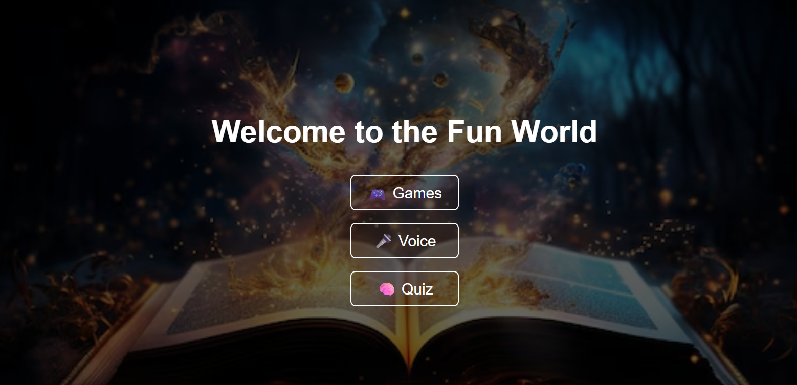
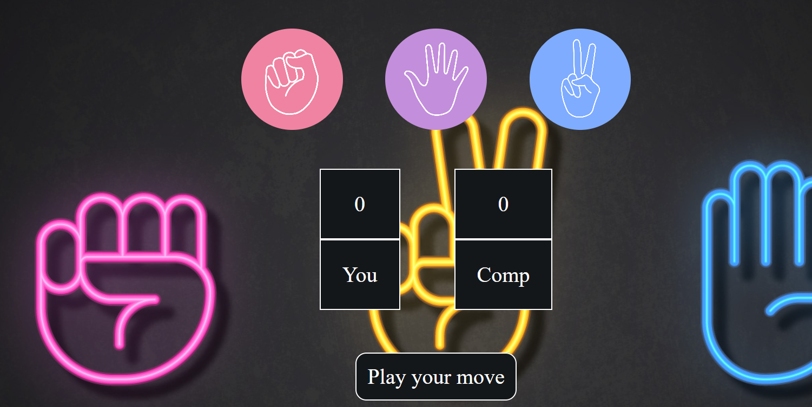
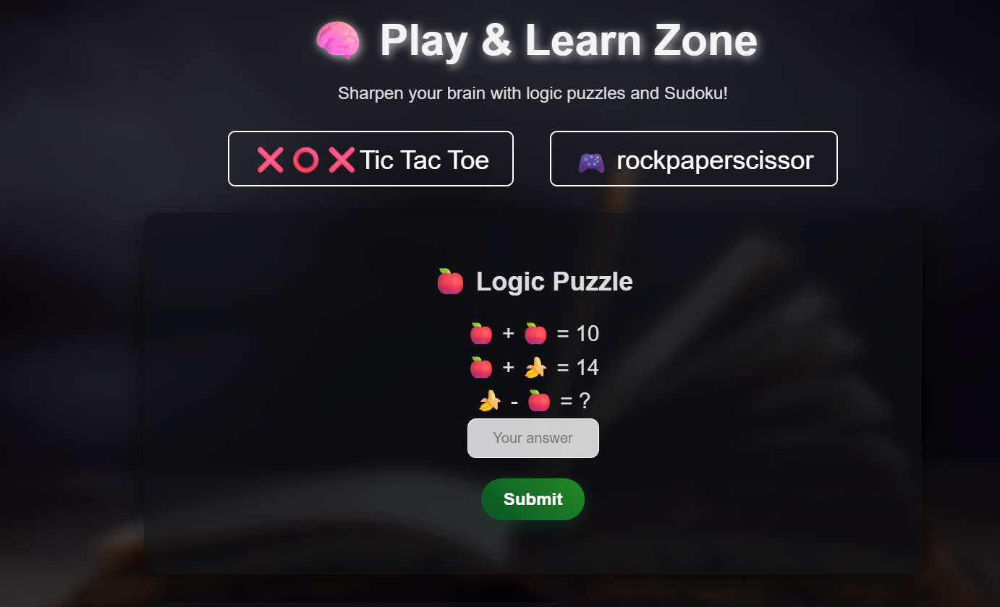
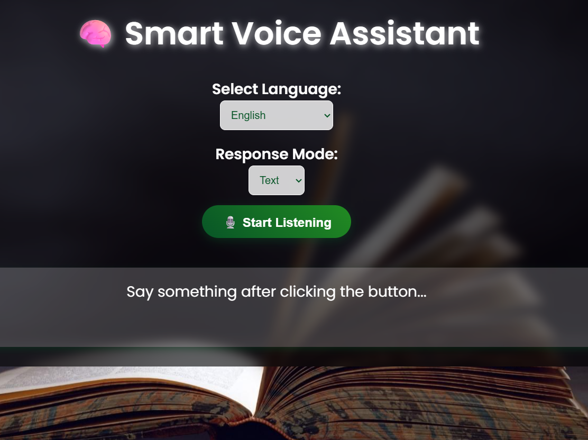

# 🎮 Fun World - Interactive Entertainment & Learning Platform



## 🌟 About The Project

**Fun World** is an interactive web application created as my very first project to combine **fun, learning, and voice interaction** into one platform.

This project includes:

* 🎮 Mini Games
* 🧠 Brain & Logic Quizzes
* 🎤 Smart Voice Assistant
* ✨ Interactive UI with modern design

The main goal of this project was to learn and implement:

* Frontend Web Development
* JavaScript Logic Building
* DOM Manipulation
* Voice Recognition Features
* User Interaction & Game Mechanics
* Responsive UI Design

This project helped me understand how real-world websites work and improved my problem-solving and development skills.

---

# 🚀 Features

## 🎮 Games Section

The website contains interactive games for entertainment and learning.

### ✊ Rock Paper Scissors

* User vs Computer gameplay
* Random computer moves
* Score tracking system
* Interactive UI animations



---

## 🧠 Quiz & Learning Zone

A dedicated section for brain games and logical thinking.

### Included:

* Tic Tac Toe
* Rock Paper Scissors
* Logic Puzzle Challenges
* Interactive Answer Submission

### Features:

* Improves logical thinking
* Engaging user experience
* Dynamic question handling



---

## 🎤 Smart Voice Assistant

An AI-inspired voice assistant integrated into the platform.

### Features:

* Speech Recognition
* Multiple Language Support
* Text & Voice Response Modes
* Interactive Listening System

### Technologies Used:

* Web Speech API
* JavaScript Speech Recognition



---

# 🛠️ Technologies Used

## Frontend

* HTML5
* CSS3
* JavaScript

## APIs & Features

* Web Speech API
* Speech Recognition
* DOM Manipulation

## Design

* Responsive Layout
* Modern UI
* Interactive Components
* Animated Elements

---

# 📂 Project Structure

```bash
Fun-World/
│
├── index.html
├── style.css
├── script.js
│
├── games/
│   ├── rockpaperscissor.html
│   ├── tictactoe.html
│   └── logicpuzzle.html
│
├── voice-assistant/
│   ├── voice.html
│   └── voice.js
│
├── assets/
│   ├── images/
│   ├── icons/
│   └── backgrounds/
│
└── README.md
```

---

# ⚡ How To Run The Project

## 1️⃣ Clone The Repository

```bash
git clone https://github.com/your-username/your-repository-name.git
```

## 2️⃣ Open The Project Folder

```bash
cd your-repository-name
```

## 3️⃣ Run The Website

Simply open:

```bash
index.html
```

in your browser.

---

# 💡 What I Learned

Through this project, I learned:

* How websites are structured
* JavaScript game logic
* Event handling
* Speech recognition integration
* Creating responsive UI designs
* Managing multiple pages and features
* Improving debugging and problem-solving skills

Since this is my **first self-created project**, it was a huge learning experience and helped me gain confidence in web development.

---

# 🎯 Future Improvements

* Add multiplayer game support
* Add leaderboard system
* Improve voice assistant intelligence
* Add more quizzes and games
* Mobile optimization improvements
* Add backend and database integration


---

# 🤝 Contributing

Contributions, suggestions, and improvements are welcome.

If you would like to improve this project:

1. Fork the repository
2. Create a new branch
3. Make your changes
4. Submit a Pull Request

